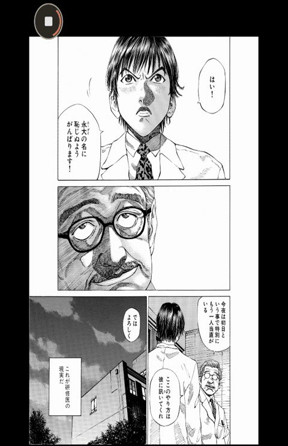
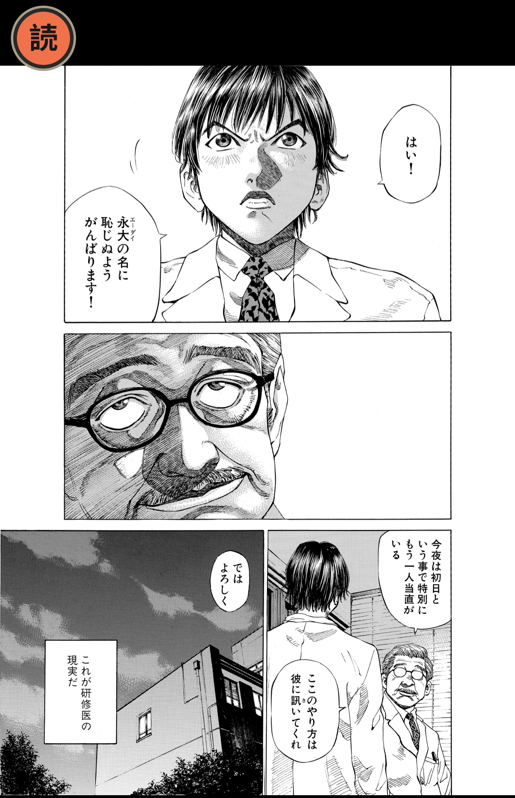
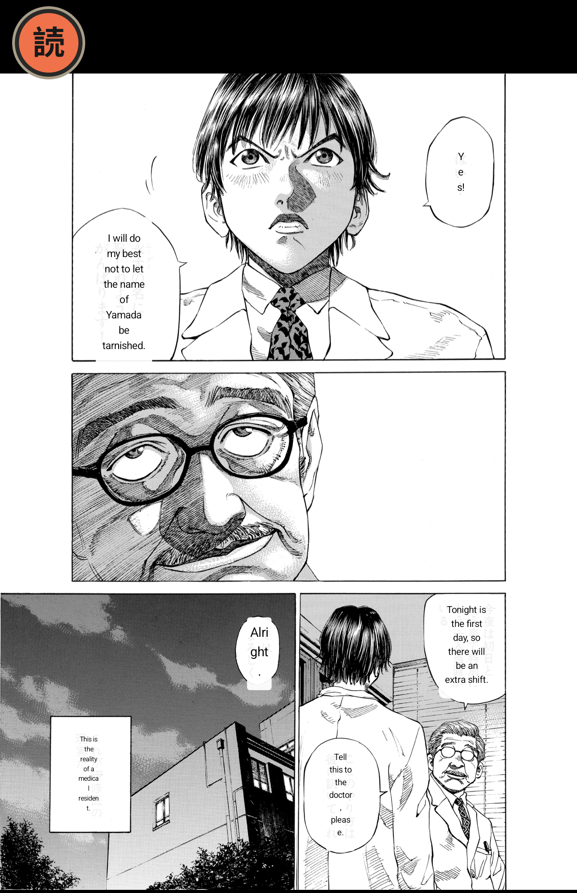
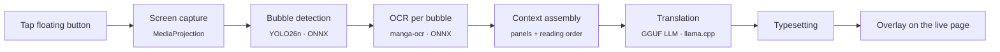

<div align="center">

# 読む Yomu

**Read any manga. Offline. Instantly.**

On-device Japanese → English manga translation for Android.
Tap once over any manga page, in any app, and read it in English. Nothing leaves your phone.


</div>

---

## See it in action

<p align="center">
  
</p>

<table>
  <tr>
    <th align="center">Before</th>
    <th align="center">After one tap</th>
  </tr>
  <tr>
    <td></td>
    <td></td>
  </tr>
</table>

<sub>Unedited output from the default model (Qwen2.5 1.5B) running on an Android emulator. Manga: ブラックジャックによろしく 佐藤秀峰 (Give My Regards to Black Jack, SHUHO SATO), used under the author's free secondary-use licence.</sub>

## Table of contents

- [Features](#features)
- [How it works](#how-it-works)
- [Models](#models)
- [Getting started](#getting-started)
- [Usage](#usage)
- [Project structure](#project-structure)
- [Testing](#testing)
- [Documentation](#documentation)
- [Contributing](#contributing)
- [License](#license)

## Features

- **Works over any app.** A floating button sits on top of your reader, browser or gallery. Yomu captures the screen only when you tap it.
- **Fully on-device.** Bubble detection, OCR and translation all run locally. No account, no API key, and no usage after the model download.
- **Page-level context.** Every bubble on the page goes to the LLM in one call, in reading order, so pronouns and tone hold across a conversation.
- **Manga-aware typesetting.** Font size and line wrapping are fitted to each bubble's bounds.
- **Choice of model.** Pick from a curated list of GGUF translation models. Models that won't fit your device's RAM are hidden.
- **Cancel any time.** Tap the floating button again to stop a translation that's still running.
- **Tunable.** Bubble confidence threshold, font scale, generation profile, resource limits, and a live resource readout.

## How it works



| Stage | Where | What it does |
|---|---|---|
| Capture | `app/capture` | Grabs a single frame of the screen through `MediaProjection` |
| Detection | `pipeline/bubble` | Finds speech bubbles and in-panel text with a single-class YOLO detector |
| OCR | `pipeline/ocr` | Reads each cropped bubble with a manga-specialised encoder–decoder |
| Context | `pipeline/context` | Groups bubbles into panels and orders them right-to-left, top-to-bottom |
| Translation | `ml/` | Sends the whole page to the LLM in the translation slot, using grammar-constrained, id-keyed output where the model supports it |
| Typesetting | `pipeline/typesetting` | Wraps and sizes the English text to fit each bubble |
| Render | `app/overlay` | Draws the typeset bubbles over the page in a system overlay window |

## Models

Yomu downloads every model on first launch (Wi-Fi required). Each download is pinned to an exact Hugging Face revision.

| Slot | Model | Licence |
|---|---|---|
| Bubble detection | [`Kiuyha/Manga-Bubble-YOLO`](https://huggingface.co/Kiuyha/Manga-Bubble-YOLO) (yolo26n, ONNX) | see [ADR-0007](docs/adr/0007-bubble-text-detection-approach.md) |
| OCR | [`l0wgear/manga-ocr-2025-onnx`](https://huggingface.co/l0wgear/manga-ocr-2025-onnx) | see model card |
| Translation (default) | **Qwen2.5 1.5B Instruct** Q4_K_M | Apache-2.0 |
| Translation | CAT-Translate 1.4B Q4_K_M | MIT |
| Translation (low storage) | CAT-Translate 0.8B Q4_K_M | MIT |
| Translation (custom) | Any GGUF you provide. Allowed but unsupported. | Its own |

Why these models were picked: [ADR-0010](docs/adr/0010-qwen-default-cat-demoted-to-floor.md), [ADR-0016](docs/adr/0016-llm-is-the-only-translator.md), [ADR-0001](docs/adr/0001-custom-model-permissiveness.md).

## Getting started

### Requirements

| | |
|---|---|
| Android device | Android 8.0 (API 26) or newer, `arm64-v8a` or `x86_64` |
| JDK | 17 |
| Android SDK | compileSdk 36, plus NDK and CMake 3.22.1 (for llama.cpp) |
| Storage | about 1.5 GB free for the default models |

### Build

```bash
git clone --recursive git@github.com:artsaraiva/yomu.git
cd yomu

# Already cloned without --recursive? Fetch llama.cpp:
git submodule update --init --recursive

# local.properties must point at your SDK
echo "sdk.dir=$HOME/Library/Android/sdk" > local.properties

./gradlew assembleDebug
./gradlew installDebug
```

## Usage

1. **Open Yomu** and let setup download the detection, OCR and translation models.
2. **Grant permissions** when asked: *Display over other apps* for the floating button, and *Screen capture* for reading the page.
3. **Start the overlay** from the Home screen.
4. **Open a manga page** in any app.
5. **Tap the floating button.** Status appears while it runs, then English bubbles cover the Japanese ones.
6. **Tap again** to cancel, or drag the button to the close zone to dismiss it.

Settings let you switch translation models, adjust the bubble confidence threshold and font scale, and cap the CPU and memory the model uses.

## Project structure

```
yomu/
├── app/        Android app: Compose UI, overlay service, screen capture, model downloads (Hilt, Room)
├── pipeline/   Page pipeline: detection → OCR → context → translation → typesetting
├── ml/         Inference: ONNX Runtime wrapper, llama.cpp JNI bridge (llama.cpp as a submodule)
├── core/       Shared types, constants, Result
├── scripts/    Device speed benchmark
└── docs/       ADRs, design system, agent docs
```

## Testing

```bash
./gradlew lint test assembleDebug      # what CI runs on every pull request
./gradlew connectedAndroidTest         # instrumented tests (needs a device or emulator)
scripts/run-speed-benchmark.sh         # per-stage timings and peak memory for every catalog model
```

The speed benchmark only reports numbers and never fails on them. Run it on a real phone when you change a model or the inference runtime, since emulator timings don't match phones.

## Documentation

| Doc | Contents |
|---|---|
| [`CONTEXT.md`](CONTEXT.md) | Domain language: deliverable, fit budget, translation slot, typeset bubble |
| [`docs/adr/`](docs/adr) | Architecture decision records: why each model, threshold and trade-off was chosen |
| [`docs/design/paper-mache-visual-system.md`](docs/design/paper-mache-visual-system.md) | The paper-mâché visual system for the app's screens and overlay controls |
| [`product-spec.md`](product-spec.md) | Product vision and long-term direction |
| [`AGENTS.md`](AGENTS.md) | Git, issue and code conventions |

## Contributing

Work is tracked as [GitHub issues](https://github.com/artsaraiva/yomu/issues).

1. Open an issue that describes the behaviour and its acceptance criteria.
2. Branch as `feat/<issue>-<short-name>` or `fix/<issue>-<short-name>`.
3. Write the failing test first, then commit with [Conventional Commits](https://www.conventionalcommits.org/).
4. Open a PR whose body starts with `Closes #<issue>`.

See [`AGENTS.md`](AGENTS.md) for the full conventions.

## License

No licence has been published yet, so all rights are reserved. Each model is covered by its own licence (see [Models](#models)).

<div align="center">
<sub>読む (yomu): "to read"</sub>
</div>
